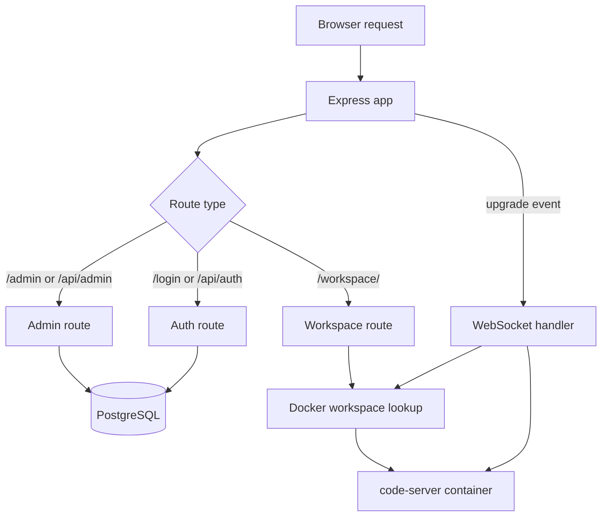

# Architecture

## Main components

### Express app

The app entry point is `src/index.js`.

It is responsible for:

- loading environment configuration
- creating the Express server
- configuring security middleware
- configuring PostgreSQL-backed sessions
- serving static admin and login pages
- mounting auth, admin, and workspace routes
- exposing `/health` and `/ready`
- handling raw WebSocket upgrades for workspace traffic

### PostgreSQL

The database layer lives in `src/db.js`.

It handles:

- pool creation
- schema bootstrapping
- admin user reconciliation at startup

### Docker orchestration

Workspace lifecycle logic lives in `src/docker.js`.

It handles:

- image verification and pulls
- workspace filesystem preparation
- container create/start/stop/delete
- readiness polling
- idle cleanup
- workspace configuration drift detection

### Workspace proxy

The workspace route lives in `src/routes/workspace.js`.

It uses `http-proxy` to forward:

- browser HTTP requests
- browser WebSocket traffic

to the per-user `code-server` container.

### Frontend pages

The repo currently serves two static pages:

- `public/login.html`
- `public/admin.html`

The actual editor UI is served by `code-server`, not by this repo.

## Request path

## Workspace networking model

The important production choice is `WORKSPACE_PROXY_MODE=network`.

That means:

- the manager runs on one Docker network shared with user workspaces
- the manager proxies to `http://csm-<username>:8080`
- user containers do not need host port exposure

This is safer and more reliable than trying to proxy back into random host ports from inside the app container.

## Security model

### Session layer

- sessions are cookie-based
- session state is persisted in PostgreSQL
- login regenerates the session
- logout destroys the session and clears the cookie

### Route guards

`src/middleware/auth.js` separates:

- unauthenticated users
- authenticated admins
- authenticated workspace users

### Workspace access

`code-server` runs with:

- `--auth none`
- a manager-enforced base path of `/workspace`
- trusted origin arguments derived from `WORKSPACE_TRUSTED_ORIGINS`

Authentication is therefore handled by the manager, not by `code-server`.
