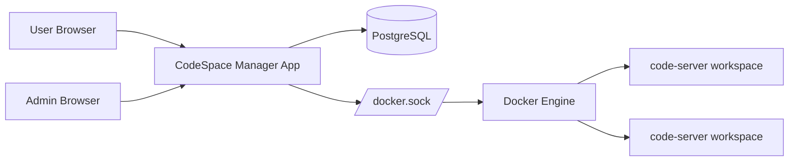

CodeSpace Manager is a multi-user control plane for `code-server`. It gives an administrator one place to manage users, provision isolated workspaces, and proxy browser traffic into per-user containers.

This guide is written to help a new maintainer understand the project quickly.

## Start here

- [System Overview]({{ '/system-overview/' | relative_url }})
- [Architecture]({{ '/architecture/' | relative_url }})
- [Code Map]({{ '/code-map/' | relative_url }})
- [Runtime Flows]({{ '/runtime-flows/' | relative_url }})
- [Data Model]({{ '/data-model/' | relative_url }})
- [Deployment and Operations]({{ '/deployment-and-operations/' | relative_url }})
- [Publishing Docs]({{ '/publishing-docs/' | relative_url }})

## What this project does

- runs an Express application as the control plane
- stores users, sessions, and workspace metadata in PostgreSQL
- creates one `code-server` container per non-admin user
- proxies HTTP and WebSocket traffic from `/workspace/` to the correct user container
- provides an admin UI for user creation, enable/disable, workspace start/stop, and deletion

## High-level architecture

## Key design choices

- Admin accounts do not get workspaces.
- Workspaces are created on demand, not pre-provisioned for every user.
- Workspace traffic is proxied over the Docker network in containerized deployments.
- Sessions are stored in PostgreSQL so app restarts do not immediately drop authentication state.
- Each workspace is reconciled against the expected image and startup command before reuse.

## Recommended reading order

1. [System Overview]({{ '/system-overview/' | relative_url }})
2. [Architecture]({{ '/architecture/' | relative_url }})
3. [Runtime Flows]({{ '/runtime-flows/' | relative_url }})
4. [Code Map]({{ '/code-map/' | relative_url }})
5. [Deployment and Operations]({{ '/deployment-and-operations/' | relative_url }})
