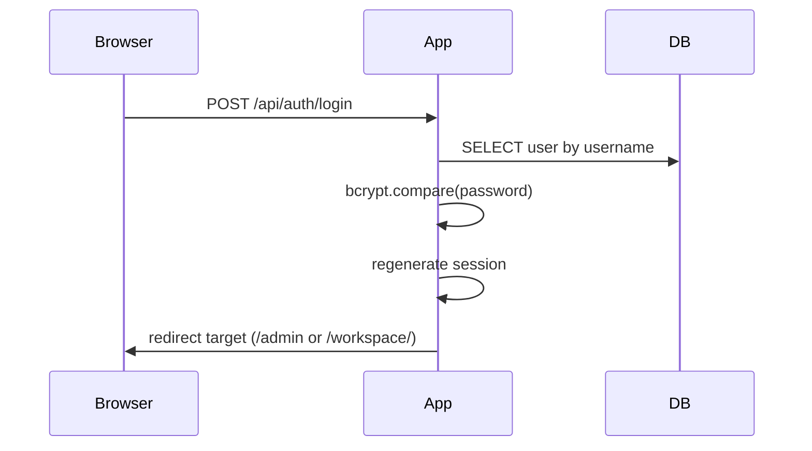
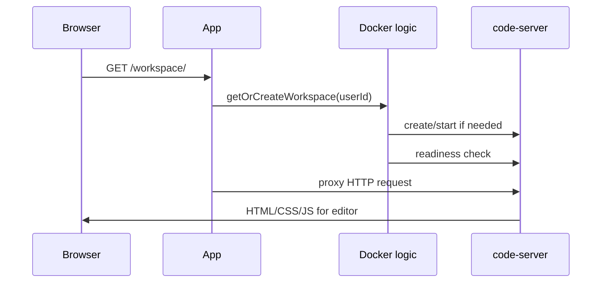

# Runtime Flows

## Application startup

When the app starts, `src/index.js` does this:

1. validates configuration
2. runs PostgreSQL migrations
3. verifies Docker connectivity unless disabled
4. starts the idle-cleanup timer
5. starts the HTTP server
6. attaches the WebSocket upgrade handler

## Login flow

Important details:

- admins are redirected to `/admin`
- non-admins are redirected to `/workspace/`
- disabled accounts are rejected

## Admin dashboard flow

The admin page is static HTML that calls JSON APIs.

Typical load:

1. browser requests `/admin`
2. middleware checks that the session is admin
3. page loads and calls `/api/auth/session`
4. page loads summary from `/api/admin/summary`
5. page loads users from `/api/admin/users`

## Workspace HTTP flow

## Workspace WebSocket flow

The WebSocket path is handled outside Express in the raw server upgrade event.

Flow:

1. browser opens a socket under `/workspace/...`
2. the app parses the session during upgrade
3. the app rejects unauthenticated or admin sessions
4. the app resolves the target workspace
5. the app strips the `/workspace` prefix
6. the app proxies the socket to the user container

Important implementation detail:

- the proxy preserves the original `Host` header
- `code-server` trusted origins must include the browser origin

## Workspace provisioning flow

When a workspace does not exist yet:

1. validate the user exists, is active, and is not admin
2. compute container and storage names from the username
3. ensure the image is available
4. run a one-shot root init container to prepare filesystem permissions
5. create the `code-server` container
6. insert a row into `workspaces`
7. poll until the workspace responds

## Reconciliation flow

Existing workspaces are not reused blindly.

Before reuse, the app checks:

- image name
- command-line arguments

If the container configuration has drifted, the app removes the old container and recreates it from current config.

## Idle cleanup flow

The cleanup timer periodically:

1. finds `workspaces.status = 'running'`
2. compares `last_active` to `IDLE_TIMEOUT_MINUTES`
3. stops matching containers
4. marks those workspaces as `stopped`
